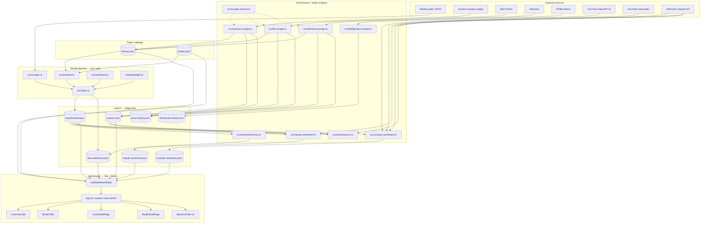
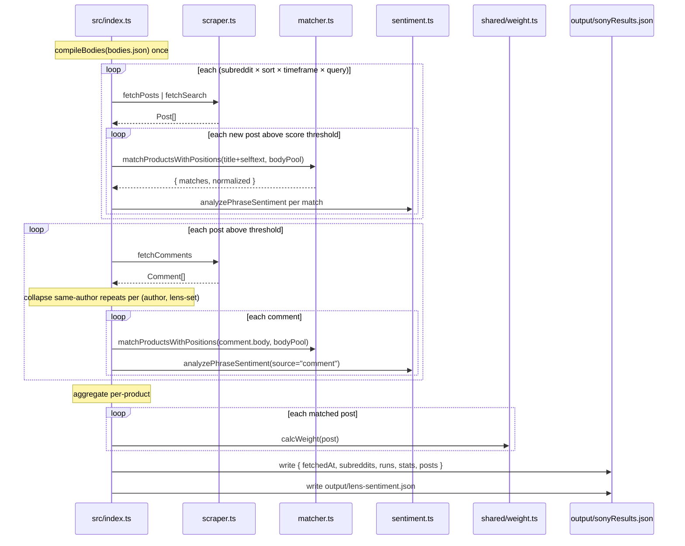

# Lenslook — Architecture

> **Version:** 1.1.0 &middot; **Generated:** 2026-04-29
> Regenerate via `/regenerate-docs` (see `.claude/commands/regenerate-docs.md`).

## System overview

Lenslook is a pipeline of independent collectors that enrich two static catalogs (`lenses.json`, `bodies.json`) and write JSON blobs into `output/`. A Vite + React dashboard reads the JSON from disk at load time and renders both a v1 view and a v2 "Spectrum" view from the same data.



## Runtime flows

### 1. Reddit ingest (`npm start`)



Crash-safe: `seenPosts` and `commentData` are module-scope, so the `.catch(...)` handler in `src/index.ts` calls `writeOutput(allMatched, partial=true)` and emits whatever was collected.

### 2. Claude enrichment (`npm run claude-sentiment [--bodies]`)

For each lens (or body) with mentions, gathers Reddit posts/comments + retailer reviews into a unified `ReviewItem[]`, batches `BATCH_SIZE` products per request, calls Claude with a `cache_control: ephemeral` system prompt that requires verbatim quotes, and runs `verifyCitations` to drop any quote not in the input text. Lens vs body mode picks one of two structurally identical system prompts (`LENS_SYSTEM_PROMPT` vs `BODY_SYSTEM_PROMPT`).

### 3. YouTube enrichment (`npm run youtube-sentiment`)

Two-step Data API: `search.list` for candidate IDs, `videos.list` for view counts and durations. Filters: `viewCount >= VIEW_COUNT_THRESHOLD` (20k) and `duration >= MIN_DURATION_SECONDS` (180). Up to `MAX_VIDEOS_PER_LENS` (6) per lens, top-N-per-brand by `scoreSentiment` (`TOP_LENSES_PER_BRAND` = 15). Transcripts from `youtube-transcript`, capped at 20k chars. One `VideoSentiment` per video.

### 4. Retail scrapers (`npm run amazon-scrape | bh-scrape | adorama-scrape [-- --bodies]`)

Headful Playwright via `launchChromiumContext`. Common helpers in `src/scraper-shared.ts`: `randomDelay` (tri-modal: base / long pause / coffee break), `humanClick` / `humanScroll`, `baseTitleMatches` / `baseBodyTitleMatches` / `looksLikeKit`, `checkMpn` for MPN-vs-stored verification.

- **Amazon**: discover phase finds an ASIN per lens via search; refresh phase navigates `/dp/{asin}` and re-scrapes price + rating + official-store badge + ~8 embedded reviews.
- **B&H**: search by `brand + name` with brand filter, then by model number; reads BH# + MPN from the codeCrumb DOM, scrapes header rating/count, click-to-load reviews.
- **Adorama**: PerimeterX-guarded. Persistent profile, injected `_px3` cookies from `adorama-cookies.json`, organic Google/DDG search referer, captcha-streak detection that prompts for cookie refresh and rewinds. Parses schema.org JSON-LD instead of DOM selectors.
- **Phillip Reeve**: plain HTTP fetch + regex (WordPress HTML). Curated URLs via `lens.reviews.phillipreeve`; flags multi-lens articles instead of ingesting them.

## Module map

```
lenslook/
├── shared/
│   ├── types.ts             # 30+ types — Lens, Body, Post, ReviewItem, *SentimentResult, etc.
│   ├── weight.ts            # calcWeight(post) — single source
│   └── youtube-transcript.d.ts
├── src/
│   ├── scraper.ts           # Reddit fetchers
│   ├── matcher.ts           # lens + body matchers; ALL_LENSES re-export
│   ├── sentiment.ts         # phrase-lexicon scoring
│   ├── index.ts             # main Reddit pipeline
│   ├── test.ts              # smoke run with formula breakdown
│   ├── sentiment-rerun.ts   # rebuild lens-sentiment.json from existing sonyResults.json
│   ├── backfill-comment-lensids.ts  # one-off post-level re-match
│   ├── claude-sentiment.ts
│   ├── youtube-sentiment.ts
│   ├── audit-lexicon.ts
│   ├── amazon-scrape.ts
│   ├── bh-scrape.ts
│   ├── adorama-scrape.ts
│   ├── adorama-scrape-missing.ts
│   ├── phillipreeve-scrape.ts
│   ├── scraper-shared.ts    # Playwright + retail helpers
│   ├── reviews.ts           # output/reviews.json read/write + isEnglish
│   ├── price-history.ts     # output/price-history.json append
│   ├── technical-reviews.ts
│   ├── search.ts            # Google/DDG site:-search helper used by Adorama
│   ├── classify-tags.ts     # one-off Lens.category backfill
│   ├── backfill-model-from-mpn.ts
│   ├── debug-context.ts
│   ├── export-safari-cookies.ts
│   ├── missing-sources.ts
│   ├── scrapers/            # empty — planned home for retail scrapers (see TODO.md)
│   └── tests/               # *-scrape-test.ts smoke files
└── dashboard/
    ├── src/types.ts         # re-exports from ../../shared/types
    ├── src/utils.ts         # display + brand helpers; calcWeight re-export
    ├── src/hooks/useDashboardData.ts
    ├── src/hooks/useHashRoute.ts
    ├── src/App.tsx          # System (Sony/Nikon) × View (v1/v2) switch
    ├── src/tabs/            # v1: Overview, Bodies, lens/body/brand detail
    ├── src/components/      # shared UI primitives
    └── src/spectrum/        # v2 layout
```

## Open consolidation opportunities

Concrete duplications still worth folding (the 04-20 list is mostly done — `shared/types.ts`, `shared/weight.ts`, `matchPost` helper, dead animation code, fetch fan-out via `fetchJson`/`fetchLensesMap` are all in).

1. **`callClaudeJson<T>()` helper.** `claude-sentiment.ts`, `youtube-sentiment.ts`, `audit-lexicon.ts` repeat the same shape: `messages.create` with cached system prompt → strip markdown fence → regex-slice `{...}` → parse with try/catch → throw on `stop_reason === "max_tokens"`. See `TODO.md`.

2. **Per-lens stat aggregation.** `src/index.ts:writeOutput` and `src/backfill-comment-lensids.ts` both build the same `statsMap`/`sentimentMap` from `posts[]`. Backfill is rarely run, so leaving as-is for now; flag if it diverges.

3. **Retail scraper directory shape.** `src/scrapers/` exists empty. Move `amazon-scrape.ts`, `bh-scrape.ts`, `adorama-scrape.ts`, `phillipreeve-scrape.ts`, `scraper-shared.ts`, and `adorama-scrape-missing.ts` in. See `TODO.md`.

4. **Multi-system support.** Output filename + dashboard data hook both already key by system, but only Sony has data; Nikon button is disabled. Adding Nikon is mostly catalog work.
