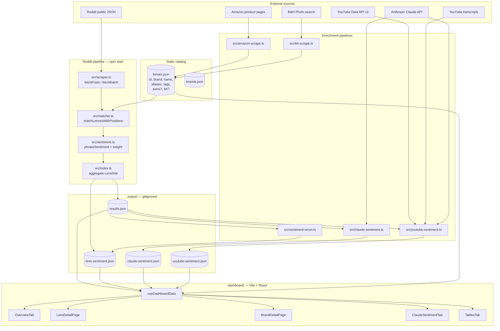
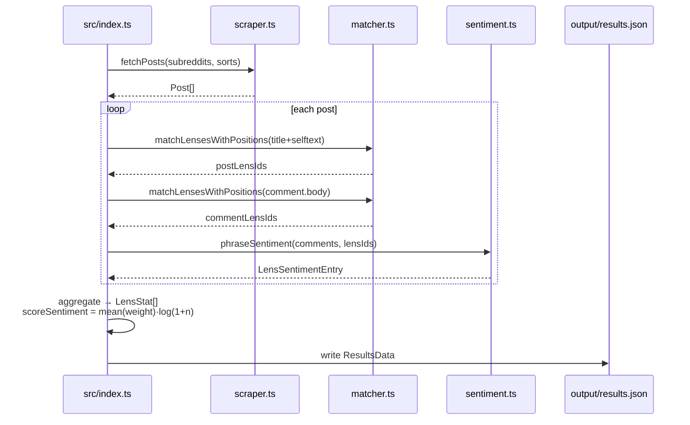

# Lenslook — Architecture

> **Version:** 1.0.0 &middot; **Generated:** 2026-04-20
> Regenerate via `/regenerate-docs` (see `.claude/commands/regenerate-docs.md`).

## System overview

Lenslook is a pipeline of independent collectors that each enrich a shared `lenses.json` catalog and write JSON blobs into `output/`. A Vite + React dashboard reads the JSON directly from disk at load time.



## Runtime flows

### 1. Reddit ingest (`npm start`)



### 2. Claude enrichment (`npm run claude-sentiment`)

Batches top-N lenses by `scoreSentiment`, feeds matched comments into Claude with `cache_control: ephemeral`, stores `ClaudeSentimentResult` per lens.

### 3. YouTube enrichment (`npm run youtube-sentiment`)

Two-step API use: `search.list` for candidate videos, `videos.list` for `viewCount`. Videos over `VIEW_COUNT_THRESHOLD` are transcribed (`youtube-transcript`), then Claude extracts **verbatim quotes** into `VideoSentiment`. One object per video, grouped under each lens id.

### 4. Price scrapers (`amazon-scrape`, `bh-scrape`)

Headful Playwright. Search by `brand + focal + aperture`, match title heuristics, click through on first official result, extract product ID + price, write back onto the lens entry.

## Consolidation opportunities

The pipeline grew organically and several patterns now appear in multiple files. Below are the concrete duplications and a suggested shape for the shared helpers.

### 1. `Lens` interface declared in four files

`Lens` is redeclared in `src/amazon-scrape.ts`, `src/bh-scrape.ts`, `src/matcher.ts`, and `dashboard/src/types.ts`. They have diverged — the scrapers each carry only the fields they care about (`bh?`, `asins?`), and drift from `dashboard/src/types.ts`.

**Fix:** introduce `src/types.ts` at the project root mirroring `dashboard/src/types.ts`; import from it in every scraper. Consider a single source of truth (e.g., `shared/types.ts`) re-exported by both trees.

### 2. Price-scraper duplication (`amazon-scrape.ts` ↔ `bh-scrape.ts`)

Both files share ~70% of their skeleton:

| Concern | Duplication |
|---|---|
| `randomDelay()` with 4–7s jitter + "sneaky guy" ASCII | verbatim in both |
| `titleMatches(title, lens)` | near-identical junk-word filter |
| `scrapePrice(page)` | same selector-iteration loop, different selector list |
| Playwright setup (`launch` + context + UA string) | copy-paste |
| Per-lens outer loop (filter `!l.<field>`, write back, tally pass/fail) | same shape |

**Fix:** extract a `src/scrape/common.ts` module:
```ts
export function randomDelay(minMs, maxMs): Promise<void>
export function titleMatches(title: string, lens: Lens, extraJunk?: string[]): boolean
export async function firstVisiblePrice(page, selectors: string[]): Promise<number | null>
export async function withBrowser<T>(fn: (page) => Promise<T>): Promise<T>
export async function runScraper<Entry>(opts: {
  field: "asins" | "bh",
  buildSearchUrl: (lens: Lens) => string,
  extractEntry: (page, lens) => Promise<Entry | null>,
}): Promise<void>
```
Each site-specific scraper shrinks to the selectors + extractor.

### 3. Claude JSON-extraction boilerplate

`claude-sentiment.ts` and `youtube-sentiment.ts` both:
1. Build a system prompt.
2. Call `anthropic.messages.create` with `cache_control: ephemeral`.
3. Regex-slice `{...}` out of the text block.
4. `JSON.parse` with try/catch.

**Fix:** `src/claude/jsonCall.ts`:
```ts
export async function callClaudeJson<T>(opts: {
  system: string;
  user: string;
  cache?: boolean;
  maxTokens?: number;
}): Promise<T>
```
Centralizes retry, JSON extraction, token accounting, and logging.

### 4. Dead animation code in `scraper.ts`

`buildFigureFrames`, `startAnimator`, and the jumping-jack frame constants are unreachable after the simplification to the "sneaky guy" log frames. Delete; keep only the three-line frame print.

### 5. Dashboard fetch fan-out

`useDashboardData` hardcodes five `fetch().then(r => r.ok ? r.json() : fallback)` calls. Each new enrichment adds another literal block.

**Fix:** define a `DATA_SOURCES` array of `{ url, fallback, key }` and `Promise.all(DATA_SOURCES.map(...))` with a shared `fetchWithFallback` helper. New pipelines become one-line additions.

### 6. Sentiment re-run vs in-pipeline sentiment

`src/sentiment-rerun.ts` duplicates the aggregation pass from `src/index.ts` so it can operate on existing `results.json`. If `index.ts` exposed `aggregateSentiment(posts, lenses)` as a pure function, both entry points could import it.

### 7. Matcher input normalization

Every caller concatenates `title + " " + selftext` before calling `matchLensesWithPositions`. Move that concatenation into the matcher (`matchPost(post)`) and drop the boilerplate at call sites (`index.ts`, `test.ts`, `sentiment-rerun.ts`, `backfill-comment-lensids.ts`).

### 8. Output schemas should live in one place

`results.json`, `lens-sentiment.json`, `claude-sentiment.json`, `youtube-sentiment.json` have their shapes implicit in the writer code and re-declared in `dashboard/src/types.ts`. Move interfaces to `shared/types.ts` (see #1) so writer and reader can't drift.

## Suggested target layout

```
lenslook/
├── shared/
│   └── types.ts              ← Lens, Post, LensStat, *SentimentResult, DashboardData
├── src/
│   ├── pipeline/
│   │   ├── scraper.ts
│   │   ├── matcher.ts
│   │   ├── sentiment.ts
│   │   └── aggregate.ts      ← extracted from index.ts
│   ├── enrich/
│   │   ├── claude-sentiment.ts
│   │   └── youtube-sentiment.ts
│   ├── scrape/
│   │   ├── common.ts         ← randomDelay, titleMatches, firstVisiblePrice, runScraper
│   │   ├── amazon.ts
│   │   └── bh.ts
│   ├── claude/
│   │   └── jsonCall.ts
│   ├── index.ts
│   ├── sentiment-rerun.ts
│   └── test.ts
└── dashboard/
    └── src/types.ts          ← re-export from ../../shared/types.ts
```

## Priority

1. **Shared types** (#1, #8) — highest leverage, unlocks everything else.
2. **Scraper common module** (#2) — largest line-count win, makes adding a third retailer trivial.
3. **Claude JSON helper** (#3) — small, high-quality-of-life.
4. **Dead code removal** (#4) — 2-minute cleanup.
5. **Dashboard fetch loop** (#5) and **aggregate extraction** (#6) — nice-to-have.
