# Lenslook — Data models (UML)

> **Version:** 1.1.0 &middot; **Generated:** 2026-04-29
> Regenerate via `/regenerate-docs` (see `.claude/commands/regenerate-docs.md`).

Class diagrams for the JSON documents and TypeScript interfaces in `shared/types.ts`. Every block corresponds to one file on disk or one exported type.

## 1. `lenses.json` — static lens catalog

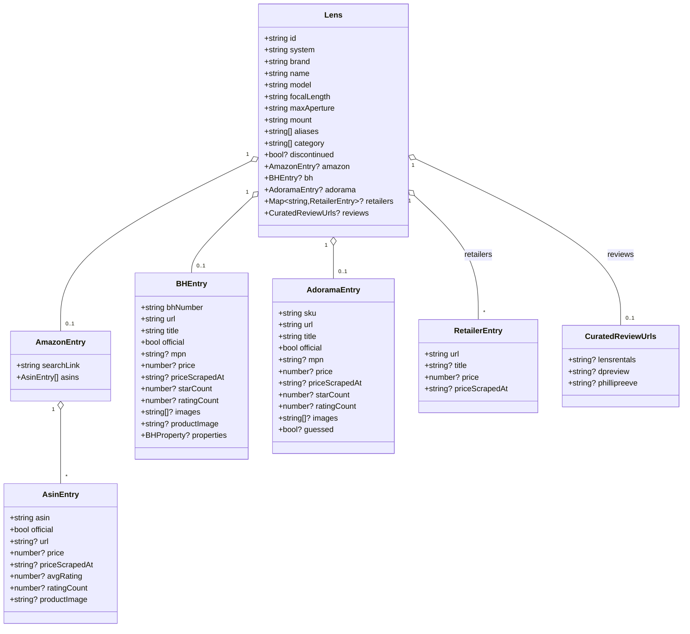

Notes:
- `system` is always `"Sony"` today. Reserved for Nikon expansion.
- `category` replaced the older `tags` field (04-22 migration). Values: `prime`, `zoom`, `superzoom`, `ultra-wide`, `wide`, `standard`, `telephoto`, `super-telephoto`, `macro`, `aps-c`.
- `discontinued` is declared but not honored anywhere — see `TODO.md`.

## 2. `bodies.json` — Sony E-mount bodies

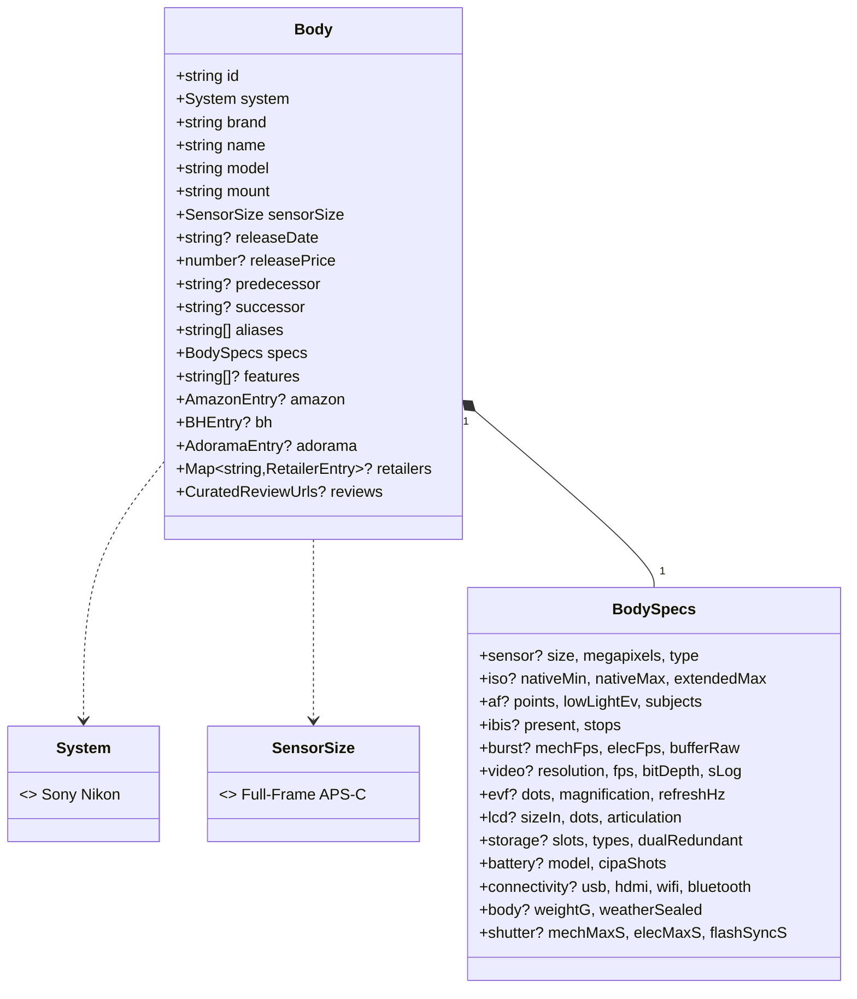

Notes:
- Body IDs always carry a `body-` prefix (e.g. `body-sony-a7iv`); lens IDs do not. Used as a cheap discriminator wherever the two streams mix.
- `BodySpecs` fields are all optional — `specs: {}` is valid. Dashboard hides empty rows.

## 3. `RetailSubject` — structural overlap of Lens and Body

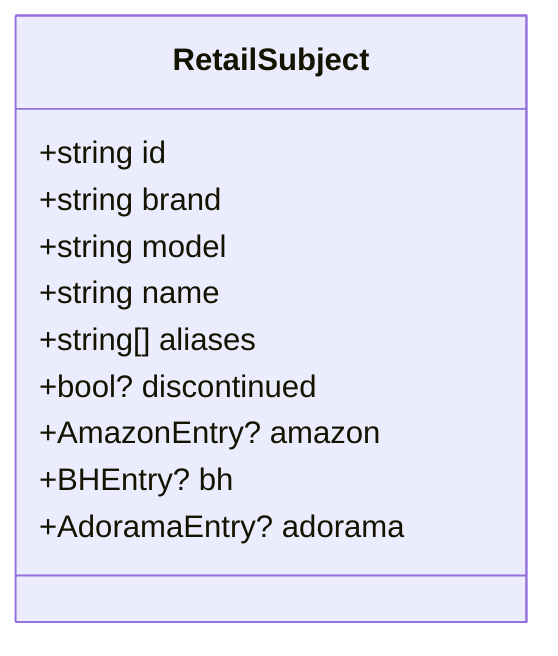

The retail scrapers operate on `RetailSubject` so the per-iteration loop doesn't need `Lens | Body` casts. `Lens` and `Body` both satisfy it structurally.

## 4. `output/sonyResults.json` — Reddit aggregate (`ResultsData`)

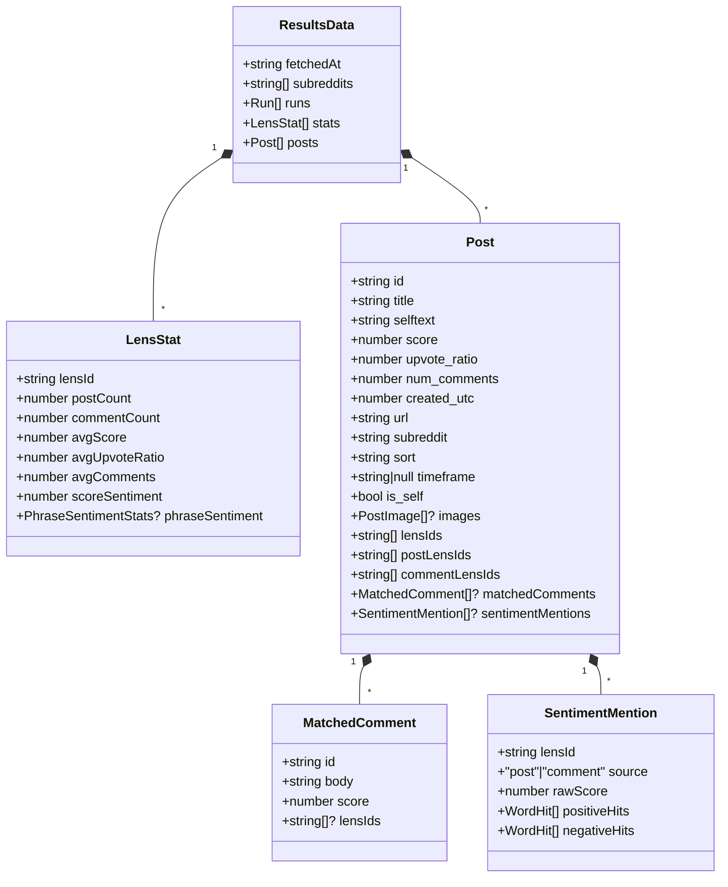

Notes:
- `lensIds` is the union of `postLensIds` and `commentLensIds`. Despite the name, both lens and body IDs flow through this field.
- `scoreSentiment = mean(weights) * log(1 + count)` where `weight = calcWeight(post)` from `shared/weight.ts`.
- `LensStat.lensId` is also a body ID when applicable. Same caveat throughout.

## 5. `output/lens-sentiment.json` — phrase-lexicon sentiment

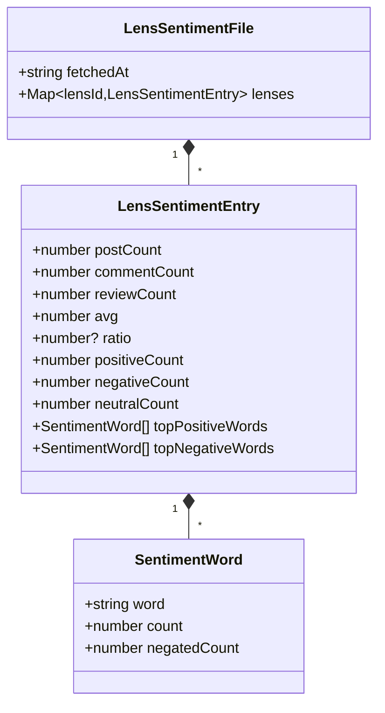

Notes:
- Mention threshold: `postCount + commentCount + reviewCount >= SENTIMENT_MIN_MENTIONS` (5). Below that, the entry is omitted.
- `reviewCount` populated by `sentiment-rerun.ts` from `output/reviews.json`. The in-pipeline write in `src/index.ts` always emits `reviewCount: 0`.

## 6. `output/claude-sentiment.json` — Claude summarized

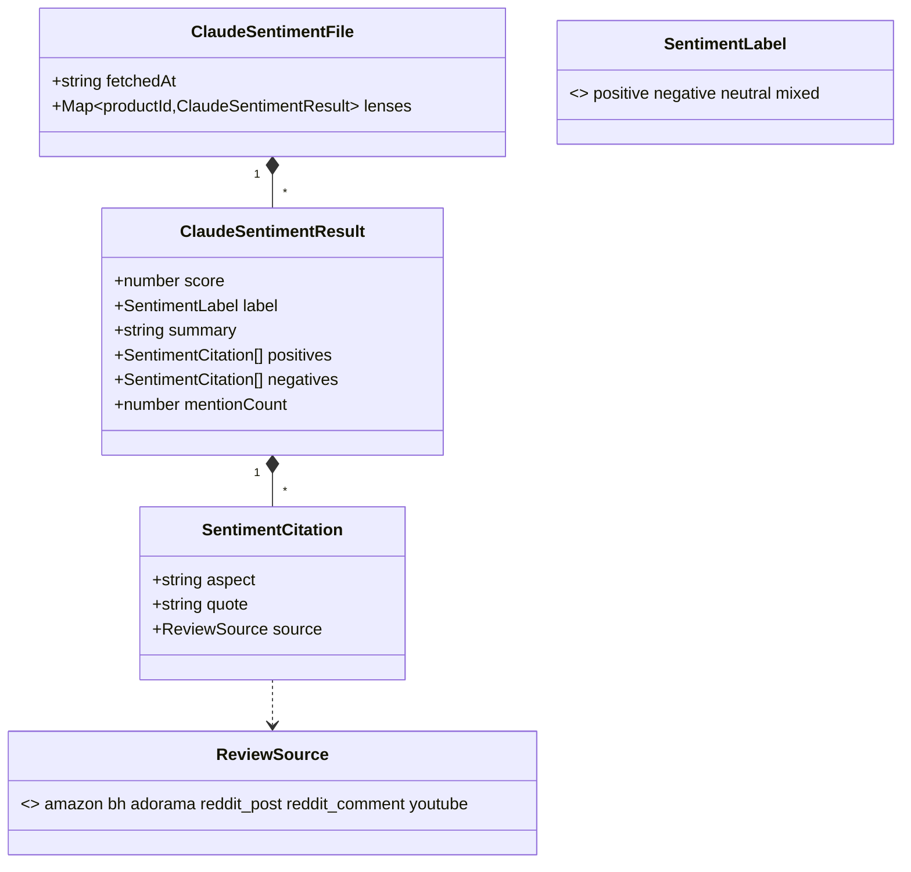

Notes:
- Quotes are verbatim — `verifyCitations` in `src/claude-sentiment.ts` drops any citation whose `quote` is not a substring of the input text (whitespace-normalized).
- `score ∈ [-1, 1]`. Same shape used for body sentiment when invoked with `--bodies`; the file key is "lenses" out of legacy.

## 7. `output/youtube-sentiment.json` — per-video sentiment

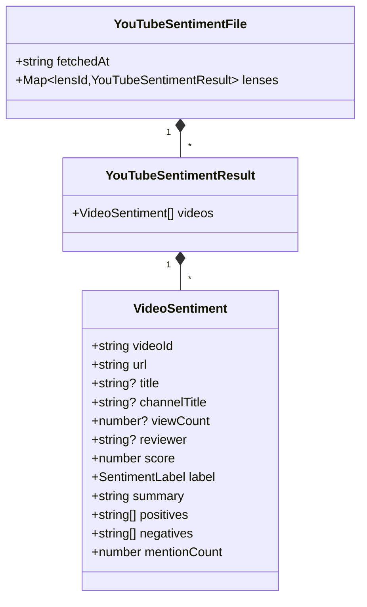

Notes:
- `positives` / `negatives` are verbatim quotes from the transcript, ≤100 chars, max 6 each.
- One `VideoSentiment` per transcript — multiple videos per lens are stored as an array, not merged.
- Timestamps deferred — see `TODO.md`.

## 8. `output/reviews.json` — retailer reviews

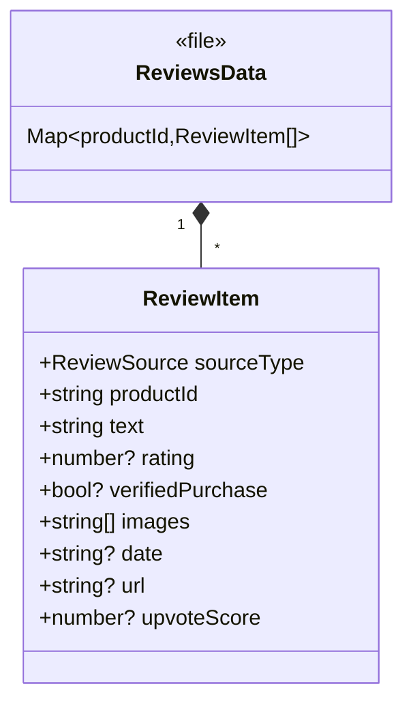

Notes:
- Flat `{ productId: ReviewItem[] }` — no `lenses` wrapper, unlike sentiment files.
- `saveReviews(productId, sourceType, ...)` replaces all existing items with that `sourceType` for that product, then appends. Re-running a scraper overwrites its own output without touching other sources.

## 9. `output/price-history.json` — append-only price log

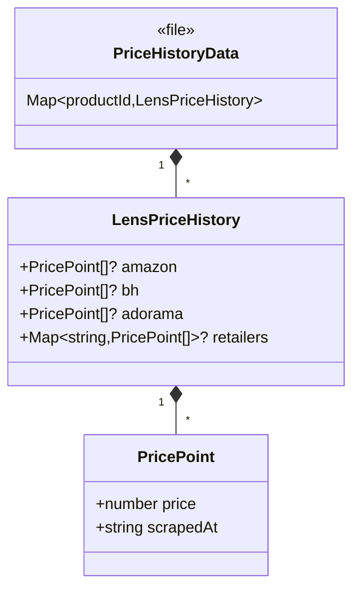

Notes:
- `recordPrice` always appends — never deduplicates by timestamp. Each scrape adds a point.

## 10. `output/technical-reviews.json` — editorial reviews

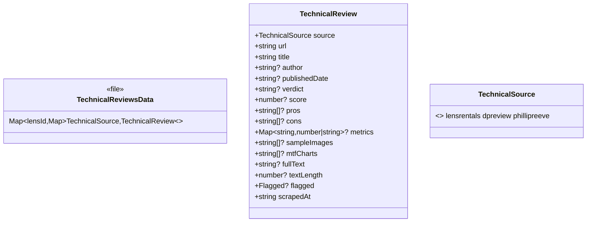

Notes:
- One review per `(lensId, source)`. Re-running overwrites in place.
- `flagged` set when a multi-lens article or not-found page is detected; `fullText` is omitted in that case.

## 11. Dashboard runtime aggregate — `DashboardData`

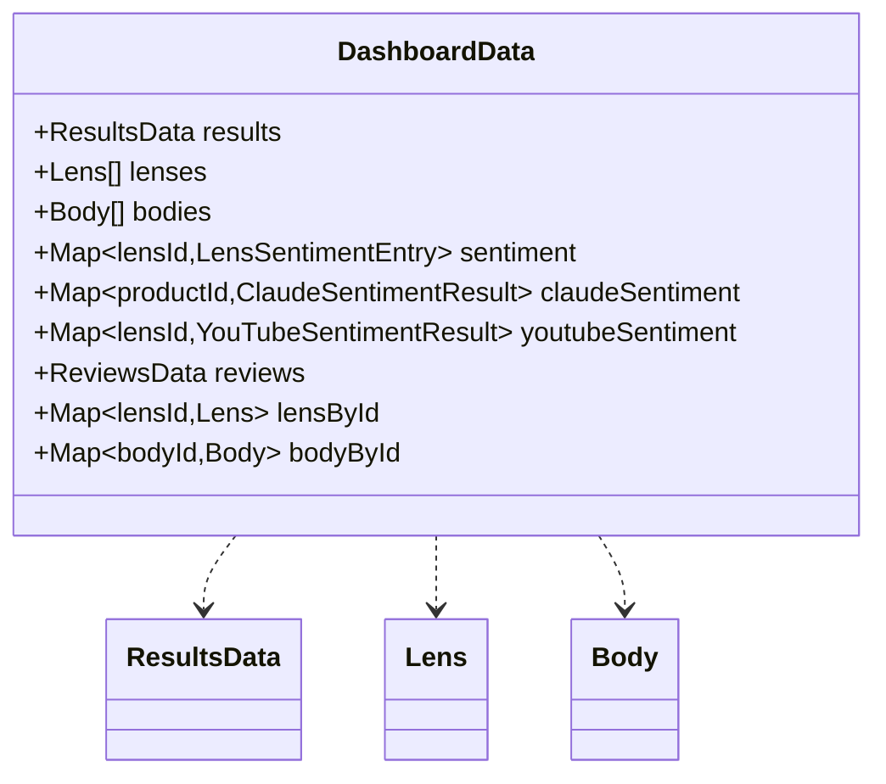

Notes:
- `useDashboardData(system)` parallel-fetches the seven files, filters lenses to the active system, and hides lenses with zero Reddit mentions AND no retail URL.
- Bodies are filtered by `b.system === system` only — currently the bodies catalog is Sony-only.

## 12. Cross-file relationships

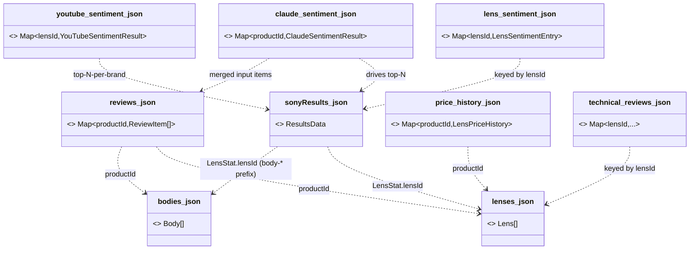

`lenses.json` + `bodies.json` are the join keys. Every enrichment is keyed by `productId`, where lens IDs and body IDs share a string namespace distinguished by the `body-` prefix.
