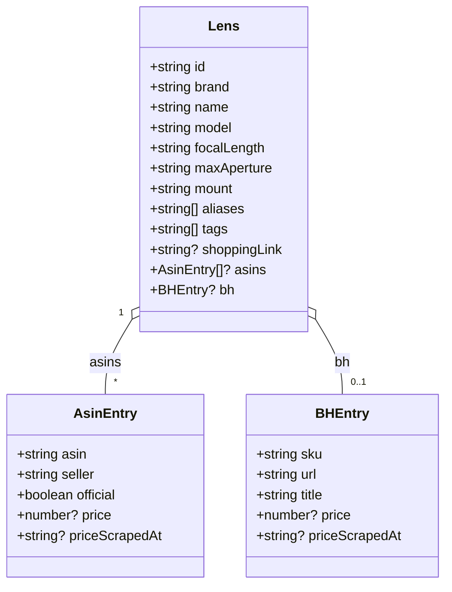
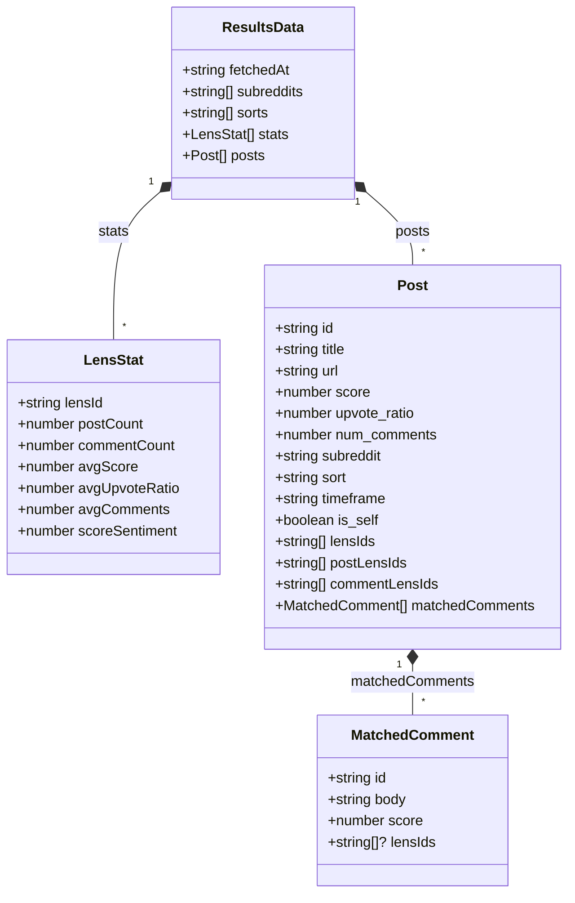
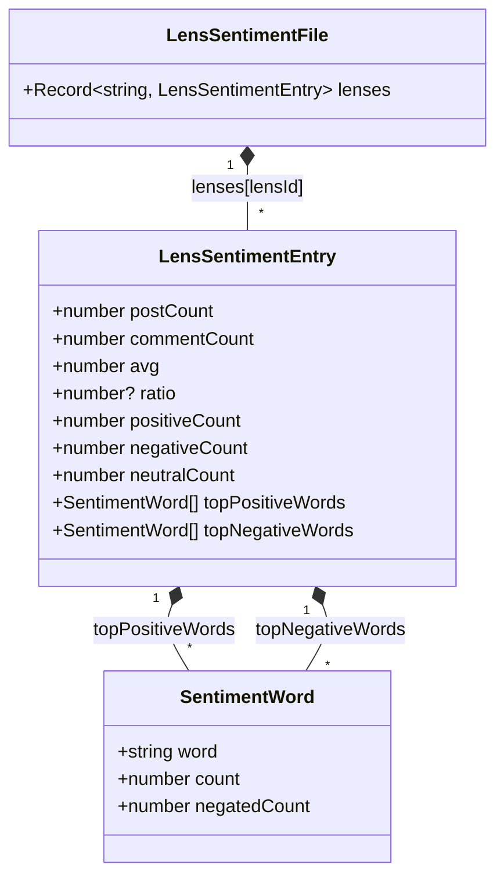
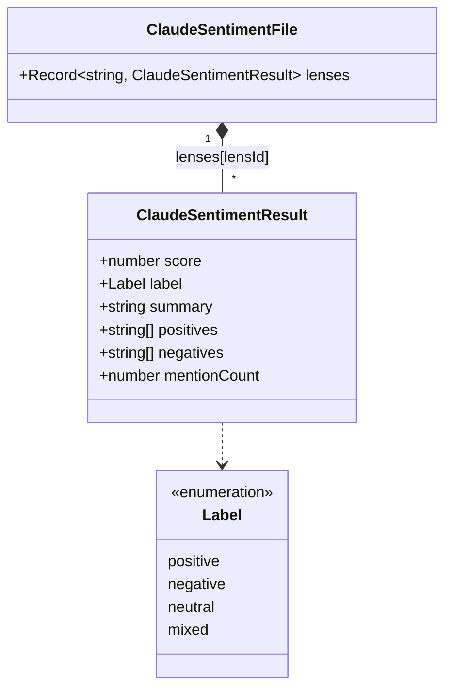
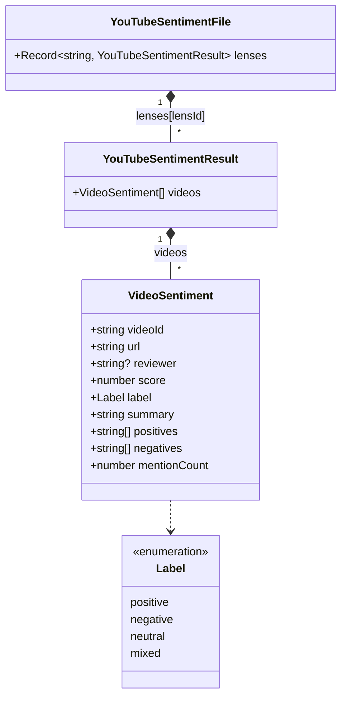
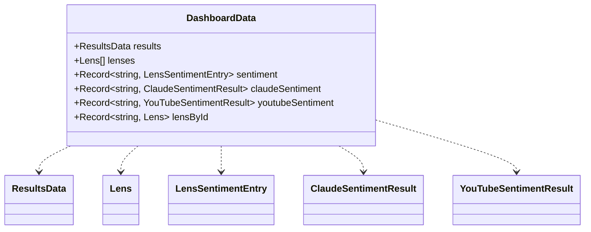
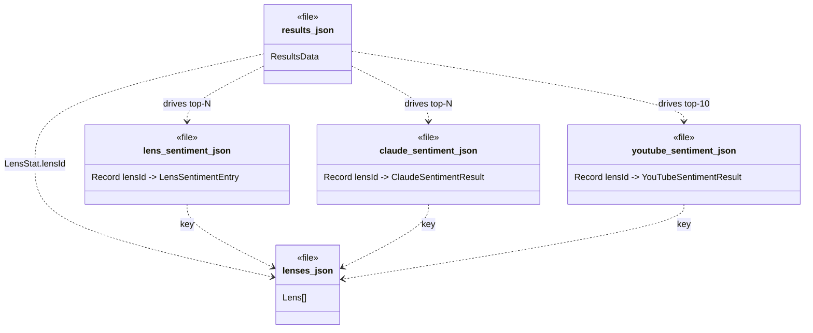

# Lenslook — Data models (UML)

> **Version:** 1.0.0 &middot; **Generated:** 2026-04-20
> Regenerate via `/regenerate-docs` (see `.claude/commands/regenerate-docs.md`).

Class diagrams for the JSON documents produced and consumed by the pipeline. Every block corresponds to one file on disk or one TypeScript interface in `dashboard/src/types.ts`.

## 1. `lenses.json` — static catalog

Notes:
- `tags` currently includes `Sony FE Full-Frame Primes`, `Sony FE Full-Frame Zooms`, `Sigma Full-Frame Lenses`, `Tamron Full-Frame Lenses`.
- `asins` is populated by `amazon-scrape.ts`; multiple sellers per lens are allowed but current scraper stops at the first official match.
- `bh` is populated by `bh-scrape.ts`; single entry per lens.

## 2. `output/results.json` — Reddit aggregate (`ResultsData`)

Notes:
- `lensIds` is the union of `postLensIds` and `commentLensIds`; the dashboard filters top-matched posts by `postLensIds` only (comment-only matches are noisy).
- `scoreSentiment = mean(weight) * log(1 + postCount)`; see `CLAUDE.md` for the weight formula.

## 3. `output/lens-sentiment.json` — phrase-based sentiment

Notes:
- Keyed by `lensId`. `avg` is mean lexicon score across matched contexts; `ratio` is positive / (positive + negative) or `null` when both are zero.

## 4. `output/claude-sentiment.json` — LLM-summarized sentiment

Notes:
- `score` ∈ [-1, 1]. `summary`, `positives`, `negatives` are Claude-generated prose.

## 5. `output/youtube-sentiment.json` — per-video review sentiment

Notes:
- `positives` / `negatives` are **verbatim quotes** from the transcript, under 100 chars each, max six per category.
- One `VideoSentiment` per transcript analyzed — multiple videos per lens are stored as an array rather than merged.

## 6. Dashboard aggregate — `DashboardData`

The single object `useDashboardData` hands to every tab.

Notes:
- `lensById` is a convenience map built client-side in `useDashboardData` from `lenses[]`.
- Sentiment maps all key on `lensId`, so `dashboardData.claudeSentiment[lens.id]` / `dashboardData.youtubeSentiment[lens.id]` are the canonical per-lens lookups.

## 7. Cross-file relationships

How the documents reference each other at runtime. `lenses.json` is the join key; every enrichment file is keyed by `lensId`.

